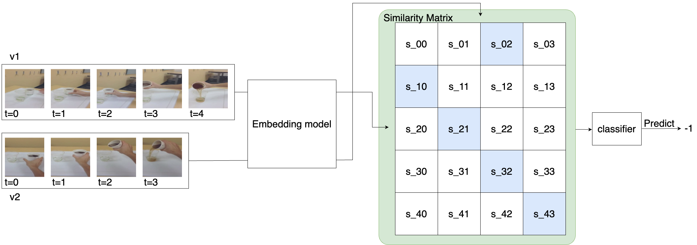

# Beyond Audio and Pose: A General-Purpose Framework for Video Synchronization

Pytorch code for synchronizing two videos that are not aligned in time.



## Requirements

```bash
# create conda env and install packages
conda create -y --name videosync_carl python=3.7.9
conda activate videosync_carl

conda install -y pytorch==1.10.1 torchvision==0.11.2 torchaudio==0.10.1 cudatoolkit=11.3 -c pytorch -c conda-forge
conda install -y conda-build ipython pandas scipy pip av ffmpeg -c conda-forge

pip install --upgrade pip
pip install -r requirements.txt

# In order to resolve protobuf related error:
# AttributeError: module 'distutils' has no attribute 'version'
pip install protobuf==3.20.3
pip install setuptools==59.5.0 wandb av tensorflow-gpu==2.4.0 scikit-learn simplejson iopath easydict opencv-python matplotlib seaborn

```

## Preparing Data

Create a directory to store datasets:

```bash
mkdir /home/username/datasets
```

#### Download NTU dataset / pre-process

Download NTU videos from [here](https://rose1.ntu.edu.sg/dataset/actionRecognition/). You need to request access to the dataset.

Download NTU-SYN annotations by following links from [here](https://github.com/Yliqiang/SeSyn-Net).

```bash
python dataset_preparation/ntu_process.py
```

#### Download CMU Pose dataset / pre-process

```bash
python dataset_preparation/download_cmu_script.sh
python dataset_preparation/cmu_process.py
```

#### Download CMU Multi human dataset / pre-process

```bash
python dataset_preparation/download_cmu_multi_human_script.sh
python dataset_preparation/cmu_process.py
```

#### Download Pouring datasets / pre-process

```bash
sh dataset_preparation/download_pouring_data.sh
python dataset_preparation/tfrecords_to_videos.py
```

## Training

Check `./configs` directory to see all config settings.

Training can be monitored on wandb.

### Download ResNet50 pretrained with BYOL

Our ResNet50 beckbone is initialized with the weights trained by BYOL.

Download the pretrained weight at [pretrained_models](https://drive.google.com/drive/folders/1VwC4x5xj4Ho3bnh9wZZx--iYhIUguR-q?usp=sharing), and place it at `/home/username/datasets/pretrained_models`.

### Pretraining on NTU

Download NTU dataset and pre-process it using the above steps.

```
python -m torch.distributed.launch --nproc_per_node 1 train.py --workdir ~/datasets --cfg_file ./configs/scl_transformer_ntu_pretrain_config.yml --logdir ~/tmp/scl_transformer_ntu_pretrain_logs
```

### Pretraining on Kinetics400

Download K400 dataset from https://github.com/cvdfoundation/kinetics-dataset

```
python -m torch.distributed.launch --nproc_per_node 1 train.py --workdir ~/datasets --cfg_file ./configs/scl_transformer_k400_pretrain_config.yml --logdir ~/tmp/scl_transformer_k400_pretrain_logs
```

### Checkpoints

We provide the checkpoints trained CARL method at [link](https://drive.google.com/drive/folders/1ZWBDoAHKV8O3EMSOLO9iO0ohCwbC7hwY?usp=sharing).

Place these checkpoints at `/home/username/tmp` to evaluate them.

## Evaluation

Start evaluation.

```bash
python -m torch.distributed.launch --nproc_per_node 1 evaluate.py \
--workdir /data \
--cfg_file ./configs/scl_transformer_ntu_config.yml \
--logdir ~/tmp/scl_transformer_ntu_logs

python -m torch.distributed.launch --nproc_per_node 1 evaluate.py \
--workdir /data/ssd \
--cfg_file ./configs/scl_transformer_cmu_config.yml \
--logdir ~/tmp/scl_transformer_cmu_logs

python -m torch.distributed.launch --nproc_per_node 1 evaluate.py \
--workdir /data/ssd \
--cfg_file ./configs/scl_transformer_pouring_config.yml \
--logdir ~/tmp/scl_transformer_pouring_logs
```

## Train and evaluate with sync offset classifier

Construct similarity matrices for each video pair.

```bash
python -m torch.distributed.launch --nproc_per_node 1 construct_softmaxed_sim_dataset.py \
--workdir /data/ssd \
--cfg_file ./configs/scl_transformer_cmu_config.yml \
--logdir ~/tmp/scl_transformer_cmu_logs \
--dataset_prefix cmu_pose_dataset_240_k400_pretrained
```

Train sync offset classifier.

```bash
python train_sync_offset_detector.py --prefix cmu_pose_dataset_240_k400_pretrained --sync_methods log_reg svm mlp cnn
```

Evaluate sync offset classifier.

```bash
python eval_sync_offset_detector.py --model_prefix ntu --data_prefix cmu_pose_dataset_240_k400_pretrained --models mlp
```

## Acknowledgment

The training setup code was modified from https://github.com/minghchen/CARL_code
